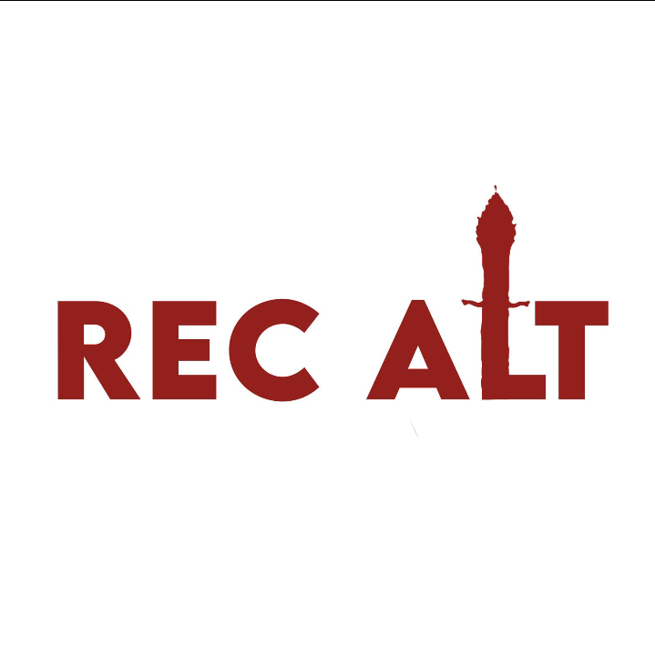

# RecAlt--Senac

## _Partes do nosso Recife que poucos conhecem._

# Introdução
  A ideia do nosso projeto é fazer com que as pessoas conheçam melhor o Recife, e até mesmo os moradores da cidade. A parte dele que vamos mostrar é a menos conhecida e visitada pelas pessoas, esses locais são chamados de "assombrados" por acontecimentos estranhos ou por historias contadas. Porem se é verdade ou não, não sabemos!

  # Estrutura de arquivos da API:

xxxxxxx

  ## Pré- requisitos

**Instalar:**
1. Node.js;
- Gerenciador de pacotes node npm;
- Dependencias:
    - `Express`;
    - `Mongoose`;
    - `Body-parser`;
    - `Nodemon`;
   

2. MongoDB Atlas Banco de dados utilizado;
3. Postman para testar as funcionalidades das Rotas;
4. Um editor de Codigo (Usei o *Visual Studio Code* );

## Contribuindo com o projeto
1. Faça o fork do projeto
https://github.com/Aline160/RecAlt--Senac.git

2. Faça o checkout na branch main
`git checkout main`

3. Crie uma branch para realizar suas modificações
`git checkout -b feature/nome-da-sua-branch`

4. Após realizar as modificações, use o comando`git add .`

5. Faça o commit `git commit -m 'mensagem aqui'`

6. Faça o push `git push --set-upstream origin feature/nome-da-sua-branch`

7. Crie um novo Pull Request para a branch `feature/staging`

### Agradecimentos

A todos que se fizeram que ajudaram de forma direta e indireta na conclusão do projeto.

_participantes:_ Ana Karolina, Ana Luiza, Edson, Gabriela, Giseli, Gustavo, Lucas, Pedro, william.